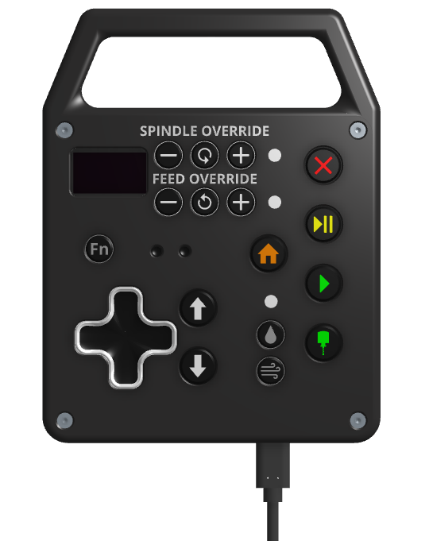

# Jog2k Enclosure

### Buttons
Buttons are designed for MSLA printing, and are assembled from 2 parts. The 'lightpipe' or 'core', and the 'cover'. Cores should be printed in white, lightpipes in translucent, and covers in black. There is a small amount of clearance designed in to the parts to allow for slight differences in resin tuning. Button pieces can be glued together with a small amount of CA glue if needed. 

### Enclsoure
The enclosure is designed to be FDM/FFF printed with a standard 0.4mm nozzle in PLA. Print tolerances are somewhat critical here to avoid excess rotational slop in the buttons; ensure your extrusion multiplier is well tuned for your filament. Materials other than PLA may require compensation for shrinkage. 

There is a recess in the rear of the enclosure for a window in the same shape as the standard enclosure. It can be cut from acrylic and glued in from the rear, with the lip hiding any glue residue. 

Holes for fasteners are designed to accept heatset inserts of the Voron typical variety. 

### Hardware Required
- 10x - M3 heatset inserts - 3 x 4 x 5mm - https://www.aliexpress.com/item/1005003286574326.html
- 4x - M3 x 16mm flat head screws  - https://www.aliexpress.com/item/32965208731.html
- 7x - M3 x 6mm cap screws - https://www.aliexpress.com/item/32965177647.html
- 7x - M3 fiber insulating washers (optional, but recommended) - https://www.aliexpress.com/item/33004539502.html

### Assembly
- Trim/deburr/clean up printed enclosure halves.
- Install heat set inserts into both enclosure halves.
- Insert buttons and lightpipes. Lightpipes are a fairly tight press fit.
- Align PCB with holes/captures
- Insert M3 x 6mm cap screws and tighten
- Flip cover over and ensure all buttons are operational. If any are stuck, loosen screws on PCB and adjust alignmnent slightly
- Insert assembled top cover into back enclosure
- Insert M3 x 16mm flat head screws and tighten
